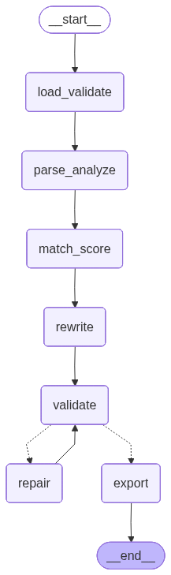

# Agentic Resume Optimizer



A compact, safety-first resume tailoring system built with LangGraph and Groq. It parses a resume, extracts JD requirements, matches skills deterministically, rewrites the resume with an LLM, validates every claim and metric, and exports only when the output is safe.

---

## What Problem Does This Solve

Most resume tools either blindly rewrite with an LLM (hallucination risk) or do simple keyword stuffing (no intelligence). This project solves both:

- **Hallucination problem** — truth check catches invented claims before export
- **Metric loss problem** — regex-based metric preservation catches dropped numbers
- **Overfit problem** — works across AI/ML, finance, business, marketing, design resumes
- **Black box problem** — every match, score, and validation decision is explainable

---

## What Makes It Different

| Feature | This Project | Typical Resume Tools |
|---|---|---|
| LLM used only where needed | ✅ | ❌ LLM for everything |
| Deterministic skill matching | ✅ | ❌ Embedding-based only |
| Hallucination gate before export | ✅ | ❌ |
| Metric preservation validation | ✅ | ❌ |
| Repair pass with targeted feedback | ✅ | ❌ |
| LangGraph agentic workflow | ✅ | ❌ |
| Structured JSON I/O for all LLM calls | ✅ | ❌ |
| No domain-specific hardcoding | ✅ | ❌ |

---

## Architecture

```
app.py          →  Streamlit UI
pipeline.py     →  LangGraph graph orchestration
llm.py          →  Groq client, prompts, JSON parsing
parser.py       →  File loading, validation, resume parsing, JD analysis
matcher.py      →  Deterministic skill matching, ATS scoring, gap report
validator.py    →  Truth check, metric preservation, export gate
exporter.py     →  DOCX, PDF, TXT export
log.py          →  Centralized logger
workflow.py     →  LangGraph flowchart renderer
```

---

## LangGraph Workflow

```
load_validate → parse_analyze → match_score → rewrite → validate
                                                              │
                                              ┌───────────────┴──────────────┐
                                         needs_repair                    all_clear
                                              │                               │
                                           repair                          export
                                              │
                                           validate ──────────────────► export
```

**Nodes and what they do:**

| Node | Responsibility |
|---|---|
| `load_validate` | Load PDF/DOCX/TXT, validate inputs |
| `parse_analyze` | LLM parses resume + analyzes JD into structured JSON |
| `match_score` | Deterministic skill matching, baseline ATS score |
| `rewrite` | LLM rewrites resume with structured JSON prompt |
| `validate` | Truth check, metric check, quality check |
| `repair` | One targeted repair pass if validation fails |
| `export` | Exports only if all safety checks pass |

**Conditional routing:** after `validate`, the graph decides autonomously — repair or export. `repair_done` flag prevents infinite loops.

---

## How Skill Matching Works

No embeddings. No ML models for matching. Pure deterministic Python:

1. **Exact match** — direct term or variant found in resume text
2. **Token stem overlap** — stemmed tokens of skill match stemmed tokens in evidence units
3. **Fuzzy ratio** — `SequenceMatcher` at ≥ 0.82 threshold
4. **Acronym matching** — `ML` matches `Machine Learning`, `FastAPI` matches via embedded acronym
5. **Semantic aliases** — `vector databases` matches if `ChromaDB`, `Pinecone`, or `FAISS` is present

All five tiers are explainable in an interview without referencing any model.

---

## ATS Score Formula

```
ATS = (matched/total × 50) + (required_matched/required_total × 35) + (evidence_quality × 15) − penalty
```

- **50%** — overall keyword coverage
- **35%** — required skills coverage (weighted higher)
- **15%** — evidence quality (how strongly each skill appears)
- **Penalty** — up to −10 for missing required skills

---

## Safety Checks

| Check | Method | Blocks Export |
|---|---|---|
| Hallucination detection | LLM truth check + false-positive filter | ✅ |
| Metric preservation | Regex extraction + key comparison | ✅ |
| Quality gate | Length, weak phrases, ATS threshold | ✅ |
| Added summary removal | Line-scan heading detection | No (silent fix) |

Export only happens when all three blocking checks pass. Otherwise output is marked `draft_needs_review`.

---

## Models Used

| Task | Model | Reason |
|---|---|---|
| Resume rewriting | `llama-3.3-70b-versatile` | Quality matters most here |
| Parsing, JD analysis, truth check | `llama-3.1-8b-instant` | Fast, high RPD, sufficient for structured JSON |

LLM calls are cached with `lru_cache` — repeated identical inputs do not cost tokens.

---

## Tech Stack

| Layer | Technology |
|---|---|
| UI | Streamlit |
| Orchestration | LangGraph |
| LLM | Groq (LLaMA 3.3 70B + LLaMA 3.1 8B) |
| LLM Client | LangChain-Groq |
| PDF parsing | PyMuPDF (fitz) |
| DOCX parsing/export | python-docx |
| PDF export | ReportLab |
| Environment | python-dotenv |

---

## Quick Start

**1. Clone and set up environment**
```bash
git clone <repo-url>
cd agentic-resume-optimizer
python -m venv .venv
source .venv/bin/activate        # Windows: .venv\Scripts\activate
pip install -r requirements.txt
```

**2. Configure environment variables**
```env
GROQ_API_KEY=your_key_here
GROQ_MODEL_STRONG=llama-3.3-70b-versatile    # optional, this is the default
GROQ_MODEL_FAST=llama-3.1-8b-instant         # optional, this is the default
```

**3. Run the app**
```bash
streamlit run app.py
```

**4. (Optional) View LangGraph flowchart**
```bash
pip install grandalf
python workflow.py
```
Opens `workflow.png` in the project directory.

---

## How To Use

1. Upload a resume — PDF, DOCX, or TXT
2. Paste the full job description
3. Enter the target role
4. Choose export format — DOCX, PDF, or TXT
5. Click **Optimize Resume**
6. Review ATS score, matched/missing skills, truth check, metric preservation
7. Download export if it passed all safety checks

---

## Project Structure

```
agentic-resume-optimizer/
├── app.py            # Streamlit UI
├── pipeline.py       # LangGraph graph
├── llm.py            # Groq client + prompts
├── parser.py         # File loading + parsing
├── matcher.py        # Skill matching + ATS scoring
├── validator.py      # Safety checks
├── exporter.py       # File export
├── log.py            # Logger
├── workflow.py       # Flowchart renderer
├── requirements.txt
├── .env              # Not committed
└── workflow.png      # Generated by workflow.py
```

---

## Design Decisions

**LLM only for language tasks** — parsing, rewriting, truth checking. Scoring, matching, metric validation, and export gating are all deterministic Python. Cheaper, faster, fully debuggable.

**Structured JSON I/O** — every LLM call sends structured JSON input and expects JSON output. Reduces hallucination surface and makes outputs parseable without fragile string cleaning.

**One repair pass maximum** — if the first rewrite regresses on metrics or ATS coverage, the graph routes to repair with explicit targeted feedback. No infinite loops.

**No embedding models** — skill matching uses token stemming, variant generation, fuzzy ratio, and semantic aliases. Keeps dependencies minimal and matching logic fully explainable.

**Export gate** — a low ATS score does not block export. Only hallucinations, missing metrics, and quality failures block it. A weak match is honest information, not a system failure.