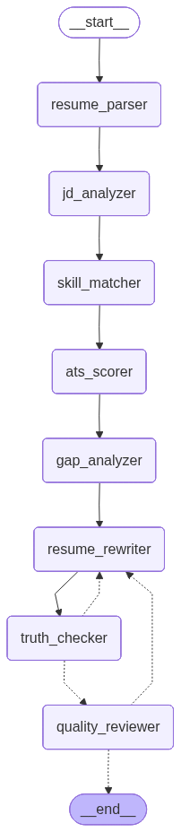

# Agentic Resume Optimizer

AI-based resume optimization project using LangGraph, Groq LLM, semantic skill matching, ATS scoring, hallucination checking, and metric preservation validation.

This project is a personal/basic deployment prototype. It is designed to be clean, explainable, and easy to run locally.

---

## Features

- Upload resume in PDF, DOCX, or TXT format
- Paste job description and target role
- Parse resume into structured JSON
- Analyze job description into required skills, preferred skills, tools, and keywords
- Match skills using semantic embeddings
- Generate ATS score with explainable breakdown
- Rewrite resume for ATS alignment
- Check for hallucinated or unsupported content
- Validate whether important metrics are preserved
- Show before/after keyword coverage comparison
- Export resume only when quality checks pass

---

## Tech Stack

- Python
- Streamlit
- LangGraph
- LangChain Groq
- Sentence Transformers
- PyMuPDF
- python-docx
- ReportLab
- Pydantic
- JSON file caching

---

## Workflow

The exact graph used by the project is rendered below from [graph/workflow.png](graph/workflow.png).

This is the real workflow image, not a recreated flow diagram.

